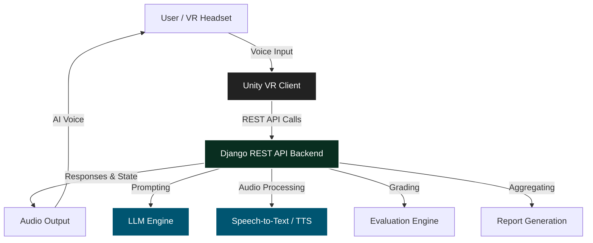

<div align="center">

# AI-VRIS — AI Powered VR Interview Simulator

[](#)
[](https://unity.com/)
[](#)
[](https://www.python.org/)
[](https://www.djangoproject.com/)
[](https://groq.com/)
[](https://opensource.org/licenses/MIT)

**A Virtual Reality interview training platform powered by AI, designed to simulate realistic technical and HR interviews using speech recognition, dynamic question generation, and immersive VR interaction.**

*Uniqueness:* **AI + VR + Speech + Real-time interview simulation.**

* 🎯 **Resume-aware interviews**
* 🎤 **Voice interaction**
* 🧠 **AI-generated questions**
* 📊 **Real-time evaluation**
* 🥽 **VR-based immersive environment**

</div>

---

<div align="center">
  <video src="docs/media/demo_1.mp4" width="80%" autoplay loop muted playsinline controls></video>
</div>

---

## 🚀 Status
✅ Major Project Completed  
✅ Demo APK Developed  
✅ Final Report Submitted  
✅ Prototype Successfully Presented  

---

## 💡 Why AI-VRIS? (Project Motivation)

Many students struggle with interview anxiety and lack access to realistic mock interview experiences. AI-VRIS was built to provide an affordable, immersive, and AI-powered platform that helps users improve confidence and communication skills before real interviews.

### ✨ Key Innovations

* **Context-aware interview generation** tailored to specific job roles.
* **Resume-conditioned AI prompting** ensuring personalized questioning.
* **Real-time VR speech pipeline** handling audio capture and transcription seamlessly.
* **Adaptive multi-stage interview orchestration** progressing from intro to technical to HR.
* **AI-generated performance analytics** evaluating candidates across multiple dimensions.

---

## 📸 Demo Screenshots & Video

> **Note**: Demo video and high-resolution screenshots are located in the `docs/media/` folder.

<div align="center">
  <a href="docs/media/demo_1.mp4">
    
  </a>
  &nbsp;&nbsp;
  <a href="docs/media/demo_2.mp4">
    
  </a>
  &nbsp;&nbsp;
  <a href="docs/media/demo_3.mp4">
    
  </a>
</div>

### Environment & Dashboard Previews
<div align="center">
  
  
</div>
<br>
<div align="center">
  
  
  
</div>

---

## ⚙️ How It Works (Workflow)

1. Candidate uploads resume.
2. Resume is parsed and summarized.
3. User enters the VR environment.
4. AI interviewer asks contextual questions.
5. User responds through voice.
6. Speech is transcribed in real-time.
7. AI evaluates the response.
8. Next question is dynamically generated based on the answer.
9. Final comprehensive report is generated.

---

## 🌟 Features

### 🎤 AI Voice Interviewer
Conducts realistic spoken interviews using AI-generated speech.

### 🧠 Dynamic Question Generation
Questions adapt based on candidate responses, resume content, and the current interview stage.

### 📄 Resume Parsing
Extracts and summarizes candidate resumes to personalize the interview experience.

### 📊 AI Performance Analysis
Evaluates technical accuracy, communication quality, and behavioral confidence.

### 🥽 Immersive VR Experience
Simulates real interview pressure using an interactive VR environment.

### 🔁 Multi-Stage Interview Flow
Supports Introduction, Resume discussion, Technical rounds, HR/behavioral rounds, and a Final wrap-up.

### 💬 Sample Interview Flow

> **AI Interviewer:** "Tell me about yourself."
> 
> **Candidate:** "I recently completed projects in AI and VR systems..."
> 
> **AI Interviewer:** "Interesting. Can you explain how you handled latency in your VR communication pipeline?"

---

## 📐 Architecture

The system follows a decoupled architecture, bridging immersive VR with heavy AI processing.

<div align="center">
  
</div>
<br>
<div align="center">
  
</div>

### 🧩 System Components

| Component | Responsibility |
| :--- | :--- |
| **Unity Client** | VR interaction & voice capture |
| **Django Backend** | Session management & REST APIs |
| **LLM Engine (Groq/Gemini)** | Dynamic question generation |
| **STT Service (GCP)** | Audio transcription |
| **TTS Service (PlayAI)** | AI interviewer voice synthesis |
| **Scoring Engine** | Candidate evaluation & feedback |
| **Reporting Engine** | Final performance analytics |



---

## 🛠️ Tech Stack

### Frontend / VR
* Unity 3D
* XR Interaction Toolkit
* C#

### Backend
* Python
* Django
* Django REST Framework

### AI & Speech
* Groq API (Fast LLM Inference)
* Google Generative AI
* Google Cloud Speech-to-Text
* PlayAI TTS

### Database
* SQLite (Dev)
* PostgreSQL Ready (Prod)

### Deployment
* Gunicorn
* WhiteNoise
* Render / Heroku Compatible

---

## 📈 Resume-Grade Metrics

* **Integrated 4+ AI services** seamlessly into a single VR application.
* **Supported multi-stage interview workflows** adapting to 5 distinct conversational phases.
* **Processed speech responses in near real-time**, ensuring fluid VR interaction.
* **Built scalable REST APIs** supporting dynamic session management and robust state handling.
* **Reduced interview generation latency** significantly using fast-inference engines like Groq.

---

## 🎓 Educational Significance

AI-VRIS explores the intersection of several cutting-edge fields:
* **Artificial Intelligence** & Generative Models
* **Immersive Computing** & Extended Reality (XR)
* **Human-Computer Interaction (HCI)**
* **Conversational AI** & Agentic Workflows
* **Speech Technologies** (ASR and TTS)

---

## 🧩 API Documentation

Core REST endpoints driving the VR experience:

| Endpoint             | Method | Description                  |
| -------------------- | ------ | ---------------------------- |
| `/api/interview/step/` | POST   | Generate next interview step |
| `/api/audio-to-text/`  | POST   | Convert speech to text       |
| `/api/resume/upload/`  | POST   | Upload and parse resume      |
| `/api/reports/`        | GET    | Fetch interview reports      |

---

## 📂 Folder Structure

```text
ai-vris/
├── VR-Game-Jam-Template-main/   -> Unity VR frontend client
├── vr_backend/                  -> Django backend API server
│   ├── interviewer/services/    -> AI orchestration (LLM, STT, TTS)
│   ├── manage.py                -> Django CLI
│   └── requirements.txt         -> Python dependencies
└── docs/media/                  -> Assets for documentation
```

---

## ⚠️ Challenges Faced

* **Synchronizing VR interaction** with backend AI responses to maintain immersion.
* **Managing speech recognition latency** across network requests.
* **Designing dynamic interview flow logic** that adapts gracefully to unpredictable human speech.
* **Handling real-time audio processing** securely between Unity and Django.
* **Integrating multiple AI services** (GCP, Groq, PlayAI) into a cohesive pipeline.

---

## ⚡ Performance Optimizations

* **Fast LLM inference** utilizing the Groq API for near-instant responses.
* **Asynchronous audio processing** ensuring the VR framerate remains unblocked.
* **Lightweight REST communication** between Unity and Django.
* **Efficient session state handling** enabling context retention without heavy database calls.

## 🛡️ Security Considerations

* **Temporary audio processing:** Voice data is processed and immediately discarded.
* **Secure API communication:** Ensuring integrity between the VR client and cloud backend.
* **Session-based report handling:** Keeping candidate evaluations private.
* **Environment variable protected credentials:** No hardcoded API keys for Groq or GCP.

---

## 🔮 Future Improvements

* Multiplayer interview panels (e.g., multiple AI recruiters).
* Facial expression analysis & Eye contact tracking.
* Emotion recognition from vocal tone.
* Offline AI inference for completely untethered setups.
* Multi-language interview support.
* Cloud analytics dashboard for long-term tracking.
* Recruiter-side evaluation portal.

---

## 🧠 Lessons Learned

1. **Managing VR latency** requires careful backend coordination; any delay breaks immersion.
2. **Real-time speech systems** are highly sensitive to network fluctuations.
3. **Prompt engineering** greatly impacts the realism and flow of the AI's questioning.
4. **User immersion** depends heavily on response timing consistency and the avatar's lifelike presence.

---

## 🚀 Installation & Setup Guide

### 1. Backend Setup

```bash
# Clone the repository
git clone https://github.com/Maxy747/ai-vris
cd ai-vris/vr_backend

# Set up Python virtual environment
python -m venv venv
source venv/bin/activate  # Windows: venv\Scripts\activate

# Install dependencies
pip install -r requirements.txt

# Environment Variables: Create a `.env` file with your keys
# GROQ_API_KEY=...
# GOOGLE_APPLICATION_CREDENTIALS=/path/to/gcp.json

# Run Server
python manage.py migrate
python manage.py runserver 0.0.0.0:8000
```

### 2. Unity Setup

1. Open **Unity Hub**.
2. Open the `VR-Game-Jam-Template-main` folder.
3. Install required XR packages via the Unity Package Manager.
4. Load the **Interview scene** from `Assets/Scenes`.
5. Point the API base URL to `http://localhost:8000`.
6. Press Play!

---

## ☁️ Deployment

* Backend configured for cloud deployment.
* Supports **Gunicorn + WhiteNoise** for static asset delivery.
* **Render/Heroku compatible** via included `Procfile` and `build.sh`.

---

## 👥 Team

* **Mazin Abdul Azeez** — AI & Backend Development
* **Libin** — VR Development
* **Ahmad** — System Integration
* **Marwan** — Additional Contributions

---

## 🙌 Acknowledgements

* **[Groq](https://groq.com/)** for lightning-fast LLM inference.
* **[Google Cloud](https://cloud.google.com/)** for highly accurate Speech-to-Text.
* **[PlayAI](https://play.ht/)** for natural-sounding Text-to-Speech synthesis.
* **[Unity XR Toolkit](https://unity.com/features/xr)** for the VR interaction foundation.
* **[Django REST Framework](https://www.django-rest-framework.org/)** for the robust backend API structure.

---

## 📄 License
This project is licensed under the MIT License.
